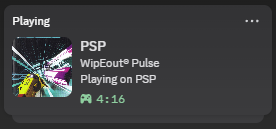
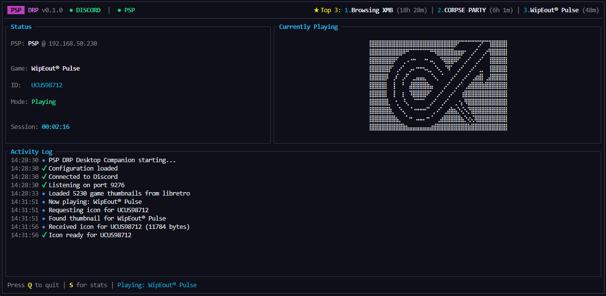
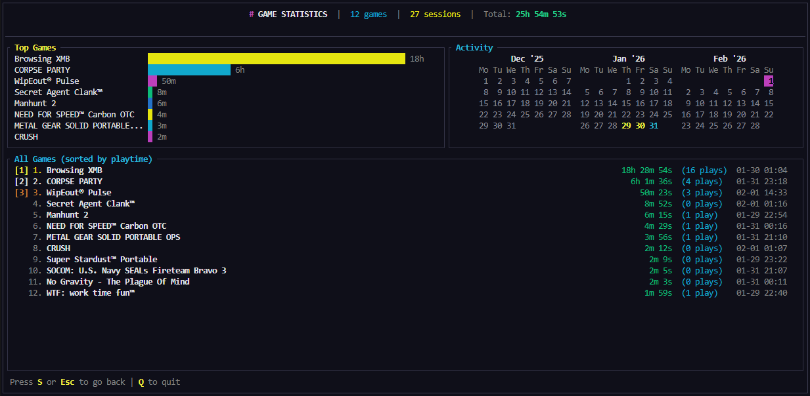

# PSP DRP (Discord Rich Presence)

<p align="center">
  
</p>
<p align="center">
  
</p>

Display your PSP gaming activity on Discord, and track your game stats! This project consists of two components:
Presence + stats (read the [nostalgic blog post](https://qberty.com/psp-drp-game-stats-discord-rich-presence-for-psp/) about it!)
1. **PSP Plugin** - Runs on your PSP under CFW, detects games/apps, and sends data over WiFi to the desktop app
2. **Desktop Companion** - A desktop app built in Rust that receives PSP game data and updates Discord Rich 


## Features
<p align="center">
  
</p>

### Discord Rich Presence
- **Game title and time** displayed in your Discord status (as best as possible)
- **Game art** automatically fetched from libretro-thumbnails database
- **Auto-discovery** - automatically finds the desktop app on your network (you can turn this off if you know your PC's IP)
- **Skip button** - hold L trigger during game boot to disable plugin for that session (configurable)
- **Per-game vblank delay** - configurable delay for games that need extra time to initialize (in case the game freezes on boot)
- **Support for UMD, ISO/CSO games, PSN, Homebrew** - works with physical and digital games (from the ones i've tested so far)
- **XMB plugin** - optionally show status even when not in a game
- **Offline mode** - track usage locally without network (see [Offline Mode](#offline-mode))

### Desktop Companion
- **Usage statistics** - tracks total playtime, session count, and last played date for each game
- **Discord Rich Presence** - updates your Discord status with game info

## Requirements

### PSP
- PSP Console (tested on PSP-1000, haven't tested on 2000/3000/Go)
- Custom Firmware installed (tested on 6.61 ARK 4 CFW so far)
- WiFi connection (preferably on the same network as the desktop app)

### Desktop
- Windows, macOS, or Linux (only tested on Windows)
- Discord Desktop app running (only tested on Windows)

### (For Development / Building)
- Docker (for building PSP plugin)
- Rust 1.70+ (for desktop app)

## Usage

### 1. Extract and Install PSP DRP

1. Download the latest release from [GitHub](https://github.com/qberty1337/PSP-DRP/releases)
2. Extract the downloaded zip file
3. Copy all PRX files to `ms0:/SEPLUGINS/pspdrp/`:
   - `psp-plugin/loader/psp_drp_loader.prx`
   - `psp-plugin/loader/psp_drp_loader_game.prx`
   - `psp-plugin/net/psp_drp_net.prx`
4. Update `ms0:/SEPLUGINS/plugins.txt` and add:
   ```
   xmb, ms0:/SEPLUGINS/pspdrp/psp_drp_loader.prx, on
   game, ms0:/SEPLUGINS/pspdrp/psp_drp_loader.prx, on
   ```
   (Do not add `psp_drp_net.prx` to plugins.txt - it is loaded automatically, also do not include the xmb line if you dont want XMB browsing/idle statuses)
5. Create config file `ms0:/SEPLUGINS/pspdrp/psp_drp.ini` or use the psp_drp.ini that is bundled in the release:
   ```ini
   enabled = 1
   desktop_ip = 192.168.1.100  ; Your PC's IP address, leave empty to auto-discover
   port = 9276
   auto_discovery = 0 ; set to 1 if you want your PSP to automatically find your PC 
   send_icons = 1 ; set to 0 if you dont want icons to show up in DRP on desktop
   send_once = 0 ; 0 for continuously send status updates, 1 for just send one
   psp_name = My PSP
   ```
3. (Optionally) Copy the `PSP DRP` folder to `ms0:/PSP/GAME/` to view your stats locally

5. Restart your PSP

6. Extract the desktop companion app, run it once to generate the config file, then edit it (or use the bundled config.toml):

   ```toml
   [discord]
   client_id = "1465202425626493188" # Or use your own
   show_elapsed_time = true
   state_text = "Playing on PSP"

   [network]
   listen_port = 9276
   discovery_port = 9277
   auto_discovery = false # set to true if you have your PSP on auto discovery
   discovery_interval = 30
   timeout_seconds = 120

   [display]
   show_tray_icon = true
   log_level = "info"
   # Game icon rendering mode: "ascii" or "braille" (braille has 4x the resolution but ascii is classic)
   icon_mode = "braille"
   ```

### 2. Run

1. Start the desktop companion app
2. Ensure your PSP's WiFi switch is on (you'd be surprised how easy it is to forget)
3. Boot your PSP and launch a game (you should see the game register in the desktop app if its supported)

### Skip Button

Hold the **L trigger** (configurable via `SKIP_BUTTON` in the INI) during game/xmb boot to prevent the plugin from loading for that session.

If you accidentally skipped or change your mind, press **SELECT + L trigger** (or SELECT + your configured skip button) to reactivate the plugin without restarting the game (if your game allows it).

## Configuration

### PSP Config (`ms0:/SEPLUGINS/pspdrp/psp_drp.ini`)

#### Basic Settings

| Option | Description | Default |
|--------|-------------|---------|
| `enabled` | Enable/disable plugin | `1` |
| `desktop_ip` | Desktop app IP address (leave empty for auto-discovery) | `` |
| `port` | Connection port | `9276` |
| `auto_discovery` | Find desktop app automatically | `1` |
| `send_once` | Battery-saving mode - send one update then disconnect | `0` |
| `send_icons` | Send game icons to desktop app | `1` |
| `psp_name` | Custom name for this PSP (shown in Discord) | `PSP` |
| `enable_logging` | Write debug logs to `ms0:/psp_drp.log` | `0` |
| `skip_button` | Button to hold during boot to skip plugin (`L`, `R`, `SELECT`, etc.) | `L` |
| `offline_mode` | Track usage locally without network (see [Offline Mode](#offline-mode)) | `0` |

#### Advanced Settings

| Option | Description | Default |
|--------|-------------|---------|
| `poll_interval_ms` | Game polling interval (ms) | `5000` |
| `heartbeat_interval_ms` | Heartbeat to desktop (ms) | `30000` |
| `game_update_interval_ms` | Game info resend interval (0 = only on change) | `60000` |
| `connect_timeout_s` | Connection timeout (0 = disable) | `30` |
| `vblank_wait` | Vblank wait before network init (~16.67ms each) | `300` |
| `GAMEID_vblank_wait` | Per-game vblank override (e.g., `NPUH10117_vblank_wait = 600`) | - |

### Desktop Config (`config.toml`)

#### Discord Settings

| Option | Description | Default |
|--------|-------------|---------|
| `discord.client_id` | Discord Application ID | `1465202425626493188` |
| `discord.show_elapsed_time` | Show play time in Discord | `true` |
| `discord.state_text` | Status text below game title | `Playing on PSP` |

#### Network Settings

| Option | Description | Default |
|--------|-------------|---------|
| `network.listen_port` | Port for PSP connections | `9276` |
| `network.discovery_port` | Port for auto-discovery broadcasts | `9277` |
| `network.auto_discovery` | Respond to PSP discovery requests | `true` |
| `network.discovery_interval` | Discovery broadcast interval (seconds) | `30` |
| `network.timeout_seconds` | Disconnect timeout for inactive PSPs | `120` |

#### Display Settings

| Option | Description | Default |
|--------|-------------|---------|
| `display.show_tray_icon` | Show system tray icon | `true` |
| `display.log_level` | Log verbosity (`error`, `warn`, `info`, `debug`, `trace`) | `info` |
| `display.icon_mode` | Game icon rendering (`ascii` or `braille`) | `braille` |

## Game Compatibility

Most PSP games work with this plugin, but some have compatibility issues:

| Game | Status | Notes |
|------|--------|-------|
| WipEout Pulse | Works | Plugin needs to grab network before the game can lock us out |
| No Gravity | Works | No special handling needed |
| Corpse Party | Works | Uses vblank wait (~10 sec delay) as it does heavy IO when booting |
| The Warriors | **Incompatible** | Game uses network modules exclusively, cannot share |
| PQ: Practical Intelligence Quotient | **Incompatible** | Freezes if ANY thread is started during boot |

### Known Incompatible Games

Some games cannot tolerate plugin threads being created during their boot sequence, or some implement their own network stacks which prevent this plugin from grabbing the network for usage. For these games, the plugin cannot be automatically skipped because game detection requires a running thread (which is what causes the freeze), or the game would crash the PSP which is unavoidable at least for the PSP 1000 as I've tested.

If a more consistent way to use the network stack is found, I'll update the plugin to handle this case.

## Offline Mode

For users who want to track game usage **without WiFi** or Discord integration, enable offline mode:

```ini
offline_mode = 1
```

In offline mode:
- **No network initialization** - saves battery and avoids compatibility issues
- **Local usage tracking** - writes play time data to `ms0:/seplugins/pspdrp/usage.json`
- **Works with PSP DRP Homebrew App** - the companion homebrew app can read and display your stats

This is useful for:
- PSPs without WiFi access or with the WiFi switch off
- Games that conflict with network initialization
- Users who just want to track playtime without Discord

The `usage.json` file is updated every 30 seconds and on game changes.

## Troubleshooting

### PSP won't connect
- Ensure WiFi switch is ON
- Ensure you have ARK-4 or WPA2PSP plugin installed (to be able to connect to modern networks)
- Check that PSP and PC are on same network
- Verify IP address in config is correct
- Check firewall allows UDP port 9276

### Discord status not updating
- Ensure Discord desktop app is running (not web version)
- Verify client_id is correct in config
- Check desktop app logs for errors

### Plugin not loading
- Verify CFW is installed correctly
- Check `plugins.txt` has correct path
- Try disabling other plugins temporarily

## Notes
From my testing using a PSP 1000 with ARK-4, keeping the WiFi on and periodically sending updates to the companion app did not have a considerably different impact on battery life versus periodically powering on the entire wifi stack every time. The difference was negligible (though I am using an aftermarket battery cell).

Unfortunately for a lot of PSP games, they takeover the net stack and this plugin either doesn't get the chance to grab it, or tries to grab it when it can't be unloaded by the game so it crashes either the game or the PSP. I've tried to mitigate this by adding a vblank wait before grabbing the network, but it's not a perfect solution. I'd be open to more consistent or robust ways to handle this.

## Development / Building

### Create Discord Application (if you want to use your own client ID)

1. Go to https://discord.com/developers/applications
2. Click **New Application** and name it (e.g., "PSP Gaming")
3. Copy the **Application ID** - this is your Client ID
4. Go to **Rich Presence** > **Art Assets**
5. Upload a PSP logo image and name it `psp_logo`

### Building PSP DRP Desktop App

```bash
cd desktop-companion
cargo build --release
```

### Building PSP Plugin

```bash
docker compose run --rm pspdev /bin/bash
# Inside container:
make clean
make
```

## Credits

- [PSPSDK](https://github.com/pspdev/pspsdk) - PSP development toolchain
- [ARK-4](https://github.com/PSP-Archive/ARK-4) - Custom firmware
- [discord-rich-presence](https://crates.io/crates/discord-rich-presence) - Rust Discord RPC library
- [libretro-thumbnails](https://github.com/libretro-thumbnails/Sony_-_PlayStation_Portable) - Game thumbnail images used by the desktop app

If you liked my work, consider grabbing a coffee:

[](https://www.buymeacoffee.com/fzzylogic)

For some support join the Discord:

[](https://discord.gg/fuzzylogic)
